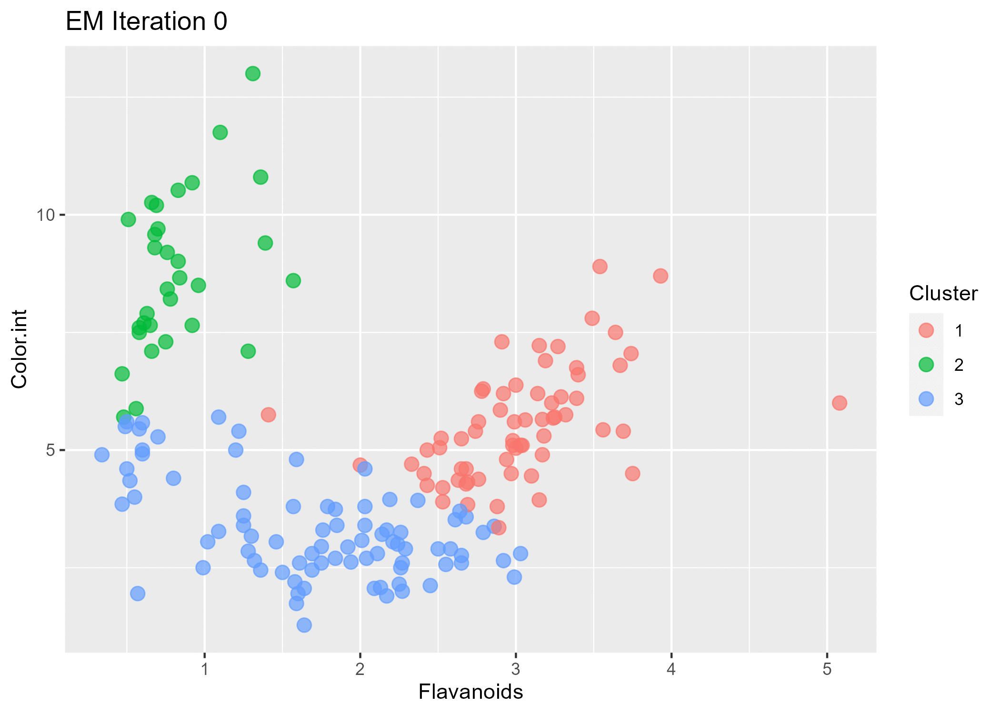
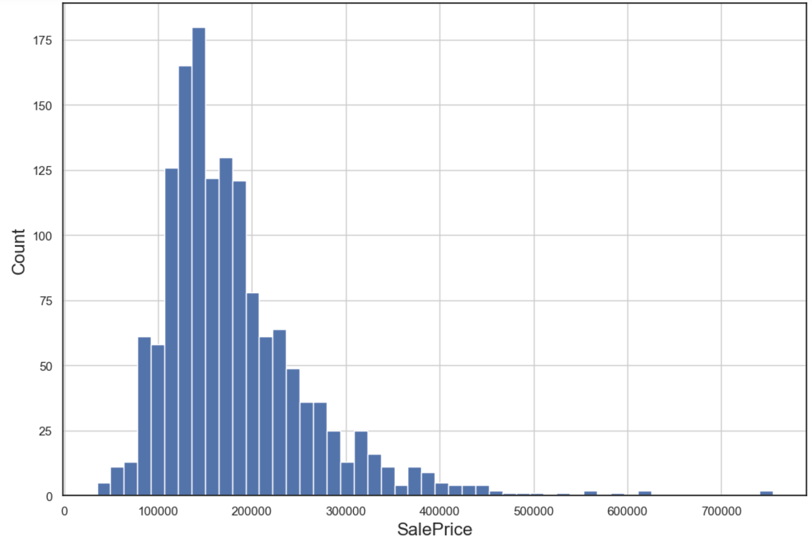
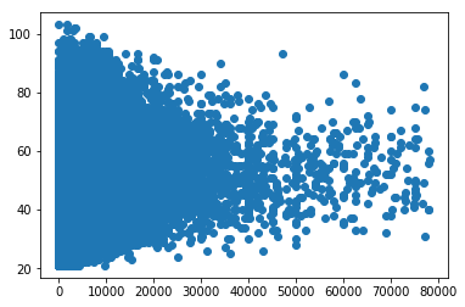
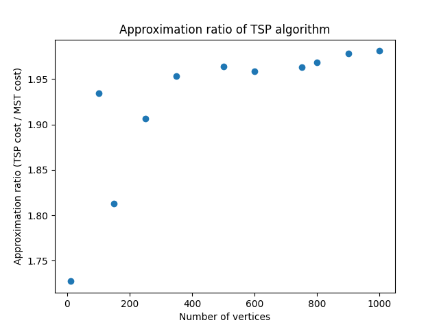
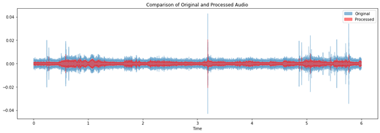

# Yao-Sheng's Portfolio

# [Project 1: Wine Clustering Analysis 🍷](https://github.com/YaoSheng-Yu/Wine_Cluster_Analysis)

-  Explore the underlying structure and natural groupings within a labeled wine dataset to uncover hidden patterns and validate the labels.
-  Building **K-means Clustering** & **EM Algorithm** models with **R**.
-  Creating animated plots to show the changes in each iteration.
-  In depth evaluating and analysing the result and advantages of the two models.

# [Project 2: House Prices Advanced Regression Techniques 🏠](https://github.com/YaoSheng-Yu/house-prices-advanced-regression-techniques)

- Undertaking comprehensive **Exploratory Data Analysis** to glean insights from the dataset.
- Encoding categorical variables using the **smoothed median** of their corresponding SalePrice, ensuring minimal data leakage.
- Leveraging Random Forests in combination with Recursive Feature Elimination (RFE) for efficient **feature selection**.
- Optimizing **Gradient Boosting Regression** through Grid Search, enhancing model performance and accuracy.

# [Project 3: Give Me Some Credit 🏦](https://github.com/YaoSheng-Yu/Give-Me-Some-Credit---predicting-due-delinquency)

- Handling missing 'Monthly Income' data by segmenting into two age groups and employing **RandomForestRegressor** for imputation.
- Checking data correlation, removing features with high **multicollinearity** to ensure model robustness.
- Using Grid Search coupled with **ROC_AUC** metric to rigorously evaluate and optimize four distinct classifiers.
- Addressing class imbalance through **under-sampling** techniques, ensuring a balanced target distribution for enhanced predictive accuracy.

# [Project 4: Traveling Salesman Problem-TSP 👨‍💼](https://github.com/YaoSheng-Yu/Traveling-Salesman-Problem-TSP)

- Developing an advanced solution to the classic **Traveling Salesman Problem (TSP)** utilizing **heuristic** algorithms.
- Efficiently implementing **Kruskal's Algorithm** to derive a **Minimum Spanning Tree (MST)** for the given weighted graph.
- Employing **Depth-First Search (DFS)** traversal on the MST to **approximate** a TSP solution, showcasing algorithmic prowess.
- Including utility scripts to generate graph test cases, enabling both best-case and worst-case scenario analysis for thorough evaluation.

  

# [Project 5: Rat USV Identification 🐀](https://github.com/YaoSheng-Yu/Rat-calls-audio-preprocessing-and-identification)

- Conducted thorough EDA to visualize noise distribution and initial accuracy, and to guide the noise cleaning process.
- Implemented advanced noise cleaning techniques, including **bandstop filters**, to isolate and enhance USV signals from background noise.
- Utilized the DeepSqueak software with YOLO model for object detection, and optimized the threshold parameters to significantly increase the precision and accuracy of USV detection.  

